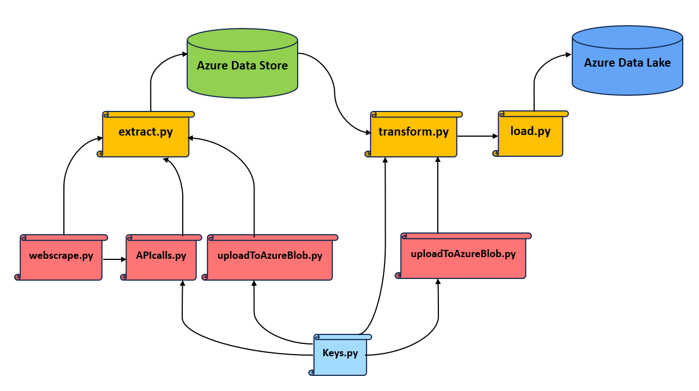
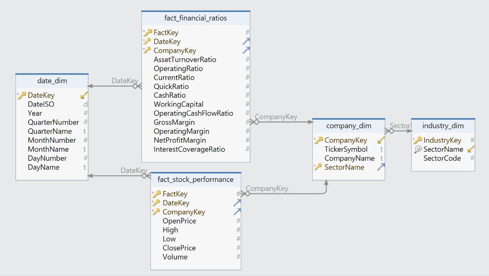
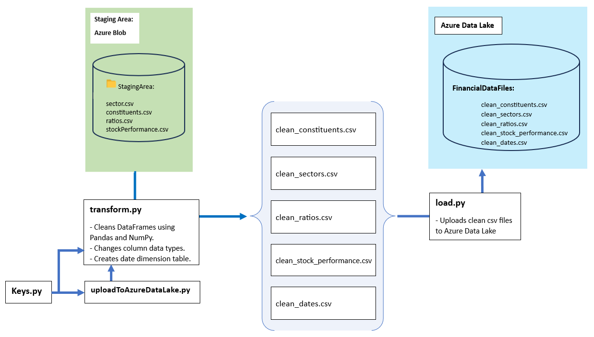
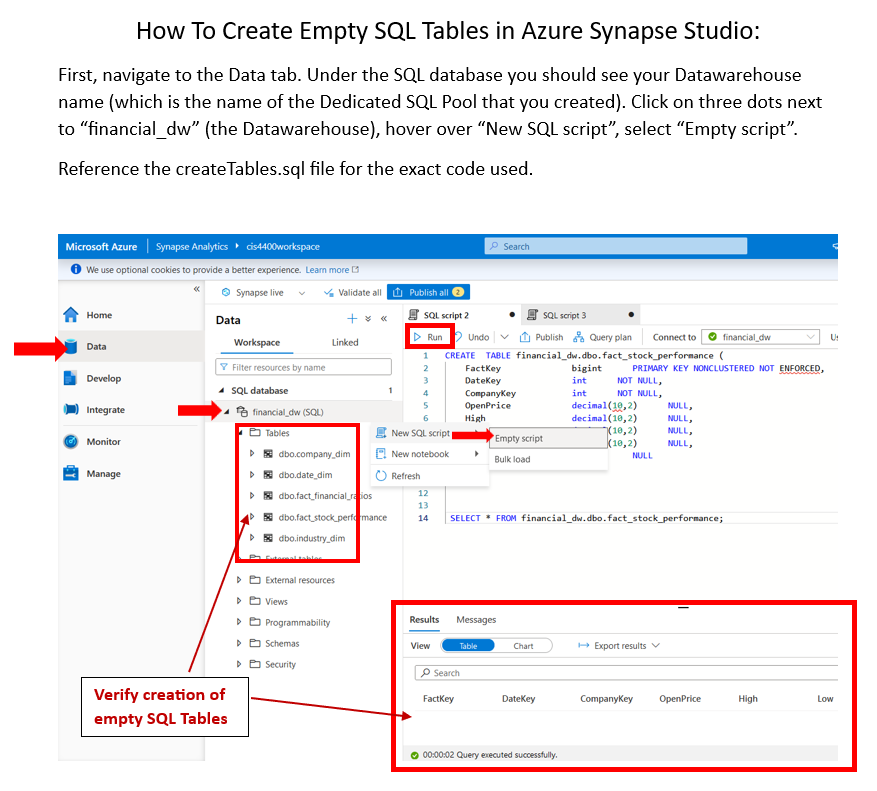

# Financial-Ratios-ETL
Visualizing correlation between S&amp;P100 stocks and 10Q financial ratios.
######
Python scripts of interest: `extract.py` `transform.py` `load.py`
### Hierarchy of Files:

### Tools used:
- Could Storage and Data Warehouse: Azure (Data Store, Data Lake, Synapse Analytics)
- ETL Implementation: Python scripts
- Dimensional Modeling: DbSchema
- Serving Data: Power BI

## ETL:
Due to relatively small data volume, ETL with Python is better suited for this project. For very large datasets, ELT with SQL would be a more efficient solution.
### 1. Extract the Data
###### What Data We Need:
1. List of S&P100 constituents (companies) for the year 2023
2. Global Industry Classification Standard
3. Daily stock performance for each constituent (Jan 1, 2023 - Sept. 30, 2023)
4. Quarterly financial ratios for each constituent (Jan 1, 2023 - Sept. 30, 2023)
###### Selecting Data Sources:
1. Wikipedia Webpages
2. Financial Modeling Prep (FMP) API
3. Yahoo Finance API
###### Before we start...
1. Obtain a premium API key from  FMP: https://site.financialmodelingprep.com/developer/docs/pricing
2. Copy your Azure Connection String (refer to "_how-to-find-azure-storage-account-connection-string.pdf_")
3. Paste both into `Keys.py`
4. Install modules locally via terminal: `pip install -r requirements.txt`
###### The Process:
After installing `requirements.txt` and modifying the `Keys.py` script, running the `extract.py` file should do the following:
######

######
Now that the data sits  in  Azure Blob, no more API requests or webscraping is needed.
### 2. Transform the Data
###### Before we start...
1. Dimensional Modeling - DbSchema

* In order to know what transformations need to be done to the files, we have to do data modeling. 
For this step, DbSchema will do a good job in exporting the physical model from the layout.
###### 
* The dimensional model follows the snowflake schema as shown below:

######
* Please follow the "_how-to-generate-sql-schema-script.pdf_" tutorial to generate your schema as a SQL file.
* Before executing any files, make sure to generate azure Blob SAS insert the HTTPS urls into `Keys.py` for each SAS url respectively. 
For more explanation, refer to: https://stackoverflow.com/a/68620427

###### The Process:

The `transform.py` is the first script in the Transform phase, 
which shows how to perform data wrangling on the datasets retrieved from the Staging Area in Azure Blob. 

`transform.py` cleans the datasets using pandas and changes data types to align with schema. The script returns finished csv files.
#### Graphic below shows what data transformations were made:

### 3. Load the Data
`load.py` takes the clean dataframes from `transform.py`, and uploads them to the Azure Data Lake Storage.

Connecting to the Data Lake is similar to connecting to a regular data storage account.
Refer to "_how-to-find-azure-storage-account-connection-string.pdf_"
###### Before loading data into Azure Synapse:
1. Create Dedicated SQL Pool in Azure Synapse Studio
2. Create empty dimension and fact tables from the SQL scripts generated by DbSchema ("_how-to-generate-sql-schema-script.pdf_"):

3. Reference the `createTables.sql` file for the exact code used.
###### Data Ingestion Pipeline:
With the SQL tables created, follow this tutorial "_how-to-load-files-from-data-lake-into-azure-synapse.pdf_"
to deploy data pipelines that ingest the data files from Azure Data Lake into your Azure Synapse Datawarehouse.

## Serve Data into BI:
### Power BI:
1. Connect to Azure Synapse Analytics
2. **Load dimension tables first, then fact tables!**
3. Visualize Insights and create dashboards/reports.

Azure Synapse does not allow Foreign Key constraints. Luckily, Power BI joins tables automatically.
#### Link to the Dashboard:

