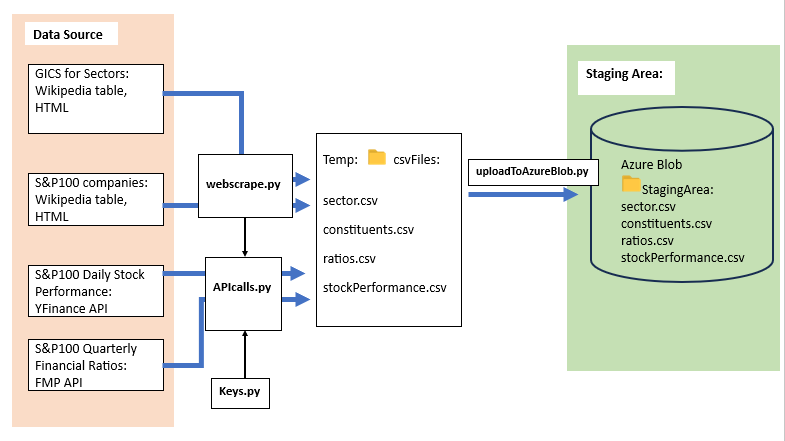

# Financial-Ratios-ETL
Visualizing correlation between S&amp;P100 stocks and 10Q financial ratios.
### Tools used:
- Could Storage and Data Warehouse: Azure (data store, Synapse)
- ETL Implementation: Python scripts
- Dimensional Modeling: DbSchema
- Serving Data: Power BI

## ETL:
Due to relatively small data volume, ETL with Python is better suited for this project. For very large datasets, ELT with SQL would be a more efficient solution.
### 1. Extract the Data
###### What Data We Need:
1. List of S&P100 constituents (companies) for the year 2023
2. Global Industry Classification Standard
3. Daily stock performance for each constituent (Jan 1, 2023 - Sept. 30, 2023)
4. Quarterly financial ratios for each constituent (Jan 1, 2023 - Sept. 30, 2023)
###### Selecting Data Sources:
1. Wikipedia Webpages
2. Financial Modeling Prep (FMP) API
3. Yahoo Finance API
###### Before we start...
1. Obtain a premium API key from  FMP: https://site.financialmodelingprep.com/developer/docs/pricing
2. Copy you Azure Connection String (refer to "how-to-find-azure-storage-account-connection-string.pdf")
3. Paste both into Keys.py
4. Install modules locally via terminal: "pip install -r requirements.txt"
###### The Process:
After installing requirements.txt and modifying the Keys.py script, running the extract.py file should do the following:

######
Now the data sits  in  Azure Blob, no more API requests or webscraping is needed.
### 2. Transform the Data
###### Dimensional Modeling:
In order to know what transformations need to be done to the files, we have to do data modeling. 
For this step, DbSchema will do a good job in exporting the physical schema from the layout.

