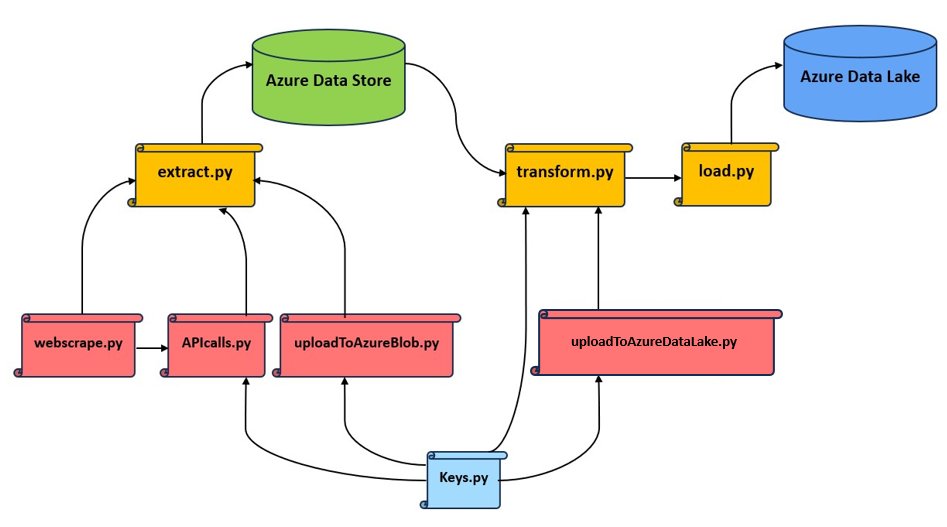

# Financial Ratios ETL Project
Purpose: to visualize correlation between S&amp;P100 stocks and 10Q financial ratios.
######
Python scripts of interest: `extract.py` `transform.py` `load.py`

### Hierarchy of Files:

###
### Tools used:
- Could Storage and Data Warehouse: Azure (Data Store, Data Lake, Synapse Analytics)
- ETL Implementation: Python scripts
- Dimensional Modeling: DbSchema
- Serving Data: Power BI
###

### Tutorials how to set up said tools properly:
This repository contains a couple of PDF files outlining the steps you need to do some actions in Azure or DbSchema:

`how-to-find-azure-storage-account-connection-string.pdf`

`how-to-generate-sql-schema-script.pdf`

Find blob SAS url: https://stackoverflow.com/a/68620427

`how-to-load-files-from-data-lake-into-azure-synapse.pdf`

###

## ETL:
Due to relatively small data volume, ETL with Python is better suited for this project. For very large datasets, ELT with SQL would be a more efficient solution.
###### What Data We Need:
1. List of S&P100 constituents (companies) for the year 2023
2. Global Industry Classification Standard
3. Daily stock performance for each constituent (Jan 1, 2023 - Sept. 30, 2023)
4. Quarterly financial ratios for each constituent (Jan 1, 2023 - Sept. 30, 2023)
###### Selecting Data Sources:
1. Wikipedia Webpages
2. Financial Modeling Prep (FMP) API
3. Yahoo Finance API
###
### 1. Extract the Data

###### Before we start...
1. Obtain a premium API key from  FMP: https://site.financialmodelingprep.com/developer/docs/pricing
2. Copy your Azure Connection String (refer to "_how-to-find-azure-storage-account-connection-string.pdf_")
3. Paste both into `Keys.py`
4. Install modules locally via terminal: `pip install -r requirements.txt`
###
###### The Process:
After installing `requirements.txt` and modifying the `Keys.py` script, running the `extract.py` file should do the following:
######

######
Now that the data sits  in  Azure Blob, no more API requests or webscraping is needed.
### 2. Transform the Data
At this point in the project, you should already have created the Azure Synapse Analytics workspace (automatically, Azure will create a Data Lake for your Synapse and link them), as well as created a Dedicated SQL Pool inside of Synapse Studio. You will need your username, password, and the name of the datawarehouse (or sql pool) later on for the data ingestion.
###
###### Before we start with data cleaning and wrangling
1. Dimensional Modeling - DbSchema

* In order to know what transformations need to be done to the files, we have to do data modeling. 
For this step, DbSchema will do a good job in exporting the physical model from the layout.
###### 
* The dimensional model follows the snowflake schema as shown below:

######
* Please follow the "_how-to-generate-sql-schema-script.pdf_" tutorial to generate your schema as a SQL file.
* Before executing any files, make sure to generate azure Blob SAS insert the HTTPS urls into `Keys.py` for each SAS url respectively. 
For more explanation, refer to: https://stackoverflow.com/a/68620427
###
###### The Process:

The `transform.py` is the first script in the Transform phase, 
which shows how to perform data wrangling on the datasets retrieved from the Staging Area in Azure Blob. 

`transform.py` cleans the datasets using pandas and changes data types to align with schema. The script returns finished csv files.

#### Graphic below shows what data transformations were made:

###
### 3. Load the Data
`load.py` takes the clean dataframes from `transform.py`, and uploads them to the Azure Data Lake Storage.

Connecting to the Data Lake is similar to connecting to a regular data storage account.
Refer to "_how-to-find-azure-storage-account-connection-string.pdf_"
###### Before loading data into Azure Synapse:
1. Create Dedicated SQL Pool in Azure Synapse Studio
2. Create empty dimension and fact tables from the SQL scripts generated by DbSchema ("_how-to-generate-sql-schema-script.pdf_"):

3. Reference the `createTables.sql` file for the exact code used.
###
###### Data Ingestion Pipeline:
With the SQL tables created, follow this tutorial "_how-to-load-files-from-data-lake-into-azure-synapse.pdf_"
to deploy data pipelines that ingest the data files from Azure Data Lake into your Azure Synapse Datawarehouse.
##

## Serve Data into BI:
### Power BI:
1. Connect to Azure Synapse Analytics
2. **Load dimension tables first, then fact tables!**
3. Visualize Insights and create dashboards/reports.

###
### Visualizations:
In the first Power BI report, we can see two charts: company distribution by sector as well as stock price history (aggregated for the whole S&P100 for now)

Then we can select a specific ticker inside the "Filter by Company Ticker" slicer (light blue box). This action will reflect the companies sector, its closing price history in 2023, and a brief description of the company in the top left.

An additional feature is that we can zoom in on a particular quarter in the grey slicer in the bottom left corner.

Let's repeat for a different company - Apple. Now we can see the adjusted description, color of the donut chart, stock price history. 

We can also filter the stock price chart by a specific sector instead of a single company by selecting a category in the donut chart in the top right corner, like so:

In the second report in Power BI, we can select and compare two (or more) companies' financial ratios. That drives useful insights when comparing two companies in the same sector with stock price trendlines moving in opposite directions.

For example, when comparing JPM whose stock price trended upwards in 2023 and USB that saw an opposite trend in their stock price, some insights we can derive from this visual is that JPM has a higher Net Profit Margin than USB, whereas its other ratios are visibly lower than for USB.

###### 

#### Is there a correlation between stock performance of the S&P100 companies and ratios from their financial statements?

Based on the analysis in Power BI, it makes sense to say that the net profit margin and the interest rate coverage ratio to some extent positively influence the stock price trend of a company in the S&P100.
The reason for that is because for shareholders it is important that the company the invests in is profitable, and with the all-time high interest rate today, it also becomes important to be able to cover any interest-bearing liabilities that the companies have.

### Lessons Learned:
1. Azure Synapse does not allow Foreign Key constraints. Luckily, Power BI connects tables automatically.
2. For the Load phase, SQLAlchemy module in Python did not work despite the tireless efforts to debug and troubleshoot the functions (you might notice the `loadScript_unsuccessful.py`, as well as the `common` folder). This might have to do with permissions issue in Synapse. To overcome this roadblock, we are loading the data to the Data Lake that was created automatically once we created the Azure Synapse Analytics workspace. From there we are ingesting the csv files into empty SQL tables in the Datawarehouse.

